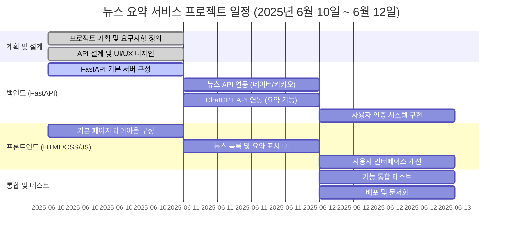

# 김유미 프로젝트 코드 리뷰

## 프로젝트 소개
뉴스 요약 서비스는 바쁜 현대인들을 위한 AI 기반 뉴스 큐레이션 플랫폼입니다. 정치, 경제, 사회, 문화 등 다양한 분야의 최신 뉴스를 자동으로 수집하고, ChatGPT API를 활용하여 핵심 내용만을 간결하게 요약해서 제공합니다. 사용자는 관심 분야를 선택하면 5분 이내에 주요 뉴스를 파악할 수 있습니다.

## 프로젝트 정보
- **프로젝트명**: 뉴스 요약 서비스
- **저장소**: https://github.com/김유미/news-summarizer
- **목표**: 분야별 최신 뉴스를 불러와 요약해서 제공하는 앱
- **기간**: 2025년 6월 10일 ~ 6월 12일 (3일간)

## 현재 상태 분석 🔍
프로젝트가 초기 학습 단계에 있으며, FastAPI 기본 구조와 CORS 설정을 학습하는 중입니다. 뉴스 요약 서비스의 실제 구현은 아직 시작되지 않았습니다.

### 구현된 파일
- **main.py**: CORS 설정 학습 코드 (중복 및 오류 포함)
- **simple_main.py**: FastAPI 최소 구현 예제
- **test_main.py**: 상세한 테스트 케이스 (TDD 접근)
- **simple_test.py**: 기본 테스트 예제

### 미구현 파일 (빈 파일)
- news-summarizer 폴더 내 모든 파일
- requirements.txt

## 잘된 점 👍
1. **명확한 프로젝트 목표 설정**
   - 뉴스 요약 서비스라는 구체적인 목표가 있음
   - 3일간의 일정별 작업 계획이 수립되어 있음

2. **테스트 주도 개발(TDD) 접근**
   - test_main.py에 상세한 테스트 케이스 작성
   - CRUD 기능과 동시성 테스트까지 고려

3. **학습 중심의 접근**
   - CORS 설정을 다양한 방법으로 시도
   - 환경별 설정 분리 시도

## 개선이 필요한 점 및 보완 방법 ⚠️

### 1. main.py 코드 정리 필요
**문제점**: 
- CORS 미들웨어가 3번 중복 설정됨 (14행, 60행, 119행)
- root 엔드포인트가 3개 중복 정의됨 (39행, 88행, 127행)
- 정의되지 않은 변수 'origins' 사용 (33행)

**보완 방법**:
```python
# main.py 정리된 버전
import os
from fastapi import FastAPI
from fastapi.middleware.cors import CORSMiddleware

app = FastAPI(
    title="뉴스 요약 서비스 API",
    description="분야별 최신 뉴스를 요약해서 제공하는 서비스",
    version="1.0.0"
)

# 환경별 CORS 설정
ENVIRONMENT = os.getenv("ENVIRONMENT", "development")

if ENVIRONMENT == "development":
    origins = ["http://localhost:3000", "http://localhost:8080"]
elif ENVIRONMENT == "production":
    origins = ["https://yourdomain.com"]
else:
    origins = ["*"]  # 테스트 환경

app.add_middleware(
    CORSMiddleware,
    allow_origins=origins,
    allow_credentials=True,
    allow_methods=["GET", "POST", "PUT", "DELETE"],
    allow_headers=["*"],
)

@app.get("/")
async def root():
    return {"message": "뉴스 요약 서비스 API", "version": "1.0.0"}

@app.get("/health")
async def health_check():
    return {"status": "healthy", "environment": ENVIRONMENT}
```

### 2. README.md 내용 불일치
**문제점**: Gantt 차트의 내용이 "맛집 데이터 구조 설계"로 되어있어 실제 프로젝트(뉴스 요약 서비스)와 일치하지 않음

**보완 방법**:
```markdown
# 수정된 Gantt 차트


### 3. 프로젝트 구조 재구성 필요
**문제점**: news-summarizer 폴더 구조는 있으나 모든 파일이 비어있음

**보완 방법**:
```python
# news-summarizer/app/main.py
from fastapi import FastAPI, HTTPException
from fastapi.staticfiles import StaticFiles
from fastapi.templating import Jinja2Templates
from .routes import news_router
from .summarizer import NewsSummarizer

app = FastAPI(title="뉴스 요약 서비스")

# 정적 파일 및 템플릿 설정
app.mount("/static", StaticFiles(directory="static"), name="static")
templates = Jinja2Templates(directory="../templates")

# 라우터 등록
app.include_router(news_router, prefix="/api/news", tags=["news"])

@app.get("/")
async def home(request: Request):
    return templates.TemplateResponse("index.html", {"request": request})
```

### 4. 뉴스 요약 서비스 핵심 기능 구현
**문제점**: 실제 뉴스 요약 기능이 전혀 구현되지 않음

**보완 방법**:
```python
# news-summarizer/app/routes.py
from fastapi import APIRouter, HTTPException
from pydantic import BaseModel
from .summarizer import NewsSummarizer

router = APIRouter()
summarizer = NewsSummarizer()

class NewsRequest(BaseModel):
    category: str = "general"
    count: int = 5

class SummarizeRequest(BaseModel):
    text: str
    max_length: int = 100

@router.get("/categories")
async def get_categories():
    return {
        "categories": ["general", "business", "technology", 
                      "health", "science", "sports", "entertainment"]
    }

@router.post("/fetch-and-summarize")
async def fetch_and_summarize_news(request: NewsRequest):
    try:
        # 1. 뉴스 가져오기
        news_articles = await summarizer.fetch_news(
            category=request.category,
            count=request.count
        )
        
        # 2. 각 뉴스 요약
        summarized = await summarizer.summarize_articles(news_articles)
        
        return {"status": "success", "data": summarized}
    except Exception as e:
        raise HTTPException(status_code=500, detail=str(e))

@router.post("/summarize-text")
async def summarize_custom_text(request: SummarizeRequest):
    summary = await summarizer.summarize_text(
        text=request.text,
        max_length=request.max_length
    )
    return {"summary": summary}
```

### 5. NewsSummarizer 클래스 구현
**문제점**: summarizer.py가 비어있음

**보완 방법**:
```python
# news-summarizer/app/summarizer.py
import httpx
import os
from typing import List, Dict
from datetime import datetime

class NewsSummarizer:
    def __init__(self):
        self.news_api_key = os.getenv("NEWS_API_KEY")
        self.openai_api_key = os.getenv("OPENAI_API_KEY")
        self.news_api_url = "https://newsapi.org/v2/top-headlines"
        
    async def fetch_news(self, category: str, count: int = 5) -> List[Dict]:
        """NewsAPI에서 최신 뉴스 가져오기"""
        async with httpx.AsyncClient() as client:
            response = await client.get(
                self.news_api_url,
                params={
                    "category": category,
                    "country": "kr",
                    "pageSize": count,
                    "apiKey": self.news_api_key
                }
            )
            
            if response.status_code == 200:
                data = response.json()
                return data.get("articles", [])
            else:
                raise Exception(f"뉴스 API 오류: {response.status_code}")
    
    async def summarize_articles(self, articles: List[Dict]) -> List[Dict]:
        """뉴스 기사들을 요약"""
        summarized = []
        
        for article in articles:
            summary = await self.summarize_text(
                text=article.get("description", "") or article.get("content", ""),
                max_length=100
            )
            
            summarized.append({
                "title": article.get("title"),
                "original_url": article.get("url"),
                "published_at": article.get("publishedAt"),
                "source": article.get("source", {}).get("name"),
                "summary": summary,
                "image_url": article.get("urlToImage")
            })
        
        return summarized
    
    async def summarize_text(self, text: str, max_length: int = 100) -> str:
        """OpenAI API를 사용한 텍스트 요약"""
        # Weniv API 사용 예시
        async with httpx.AsyncClient() as client:
            response = await client.post(
                "https://dev.wenivops.co.kr/services/openai-api",
                json=[
                    {"role": "system", "content": "뉴스 기사를 한국어로 간단명료하게 요약해주세요."},
                    {"role": "user", "content": f"다음 텍스트를 {max_length}자 이내로 요약: {text}"}
                ]
            )
            
            if response.status_code == 200:
                data = response.json()
                return data["choices"][0]["message"]["content"]
            else:
                return "요약 생성 실패"
```

### 6. 프론트엔드 구현
**문제점**: HTML, CSS, JS 파일이 모두 비어있음

**보완 방법**:
```html
<!-- news-summarizer/templates/index.html -->
<!DOCTYPE html>
<html lang="ko">
<head>
    <meta charset="UTF-8">
    <meta name="viewport" content="width=device-width, initial-scale=1.0">
    <title>뉴스 요약 서비스</title>
    <link rel="stylesheet" href="/static/style.css">
</head>
<body>
    <div class="container">
        <header>
            <h1>📰 오늘의 뉴스 요약</h1>
            <p>카테고리를 선택하면 최신 뉴스를 AI가 요약해드립니다</p>
        </header>
        
        <div class="category-buttons">
            <button class="category-btn active" data-category="general">일반</button>
            <button class="category-btn" data-category="business">비즈니스</button>
            <button class="category-btn" data-category="technology">기술</button>
            <button class="category-btn" data-category="health">건강</button>
            <button class="category-btn" data-category="science">과학</button>
            <button class="category-btn" data-category="sports">스포츠</button>
            <button class="category-btn" data-category="entertainment">연예</button>
        </div>
        
        <div id="loading" class="loading hidden">뉴스를 요약하고 있습니다...</div>
        
        <div id="news-container" class="news-container">
            <!-- 뉴스 카드들이 여기에 동적으로 추가됨 -->
        </div>
        
        <div class="custom-summarize">
            <h2>직접 텍스트 요약하기</h2>
            <textarea id="custom-text" placeholder="요약하고 싶은 텍스트를 입력하세요..."></textarea>
            <button id="summarize-btn">요약하기</button>
            <div id="custom-result" class="result hidden"></div>
        </div>
    </div>
    
    <script src="/static/script.js"></script>
</body>
</html>
```

### 7. JavaScript 구현
**문제점**: script.js가 비어있음

**보완 방법**:
```javascript
// news-summarizer/app/static/script.js
let currentCategory = 'general';

// 카테고리 버튼 이벤트
document.querySelectorAll('.category-btn').forEach(btn => {
    btn.addEventListener('click', function() {
        document.querySelector('.category-btn.active').classList.remove('active');
        this.classList.add('active');
        currentCategory = this.dataset.category;
        fetchAndDisplayNews();
    });
});

// 뉴스 가져오기 및 표시
async function fetchAndDisplayNews() {
    const loading = document.getElementById('loading');
    const container = document.getElementById('news-container');
    
    loading.classList.remove('hidden');
    container.innerHTML = '';
    
    try {
        const response = await fetch('/api/news/fetch-and-summarize', {
            method: 'POST',
            headers: {'Content-Type': 'application/json'},
            body: JSON.stringify({
                category: currentCategory,
                count: 5
            })
        });
        
        const result = await response.json();
        
        if (result.status === 'success') {
            displayNews(result.data);
        } else {
            container.innerHTML = '<p class="error">뉴스를 불러오는데 실패했습니다.</p>';
        }
    } catch (error) {
        console.error('Error:', error);
        container.innerHTML = '<p class="error">오류가 발생했습니다.</p>';
    } finally {
        loading.classList.add('hidden');
    }
}

function displayNews(newsItems) {
    const container = document.getElementById('news-container');
    
    newsItems.forEach(item => {
        const card = document.createElement('div');
        card.className = 'news-card';
        card.innerHTML = `
            <div class="news-header">
                <h3>${item.title}</h3>
                <span class="source">${item.source || '출처 없음'}</span>
            </div>
            ${item.image_url ? `` : ''}
            <p class="summary">${item.summary}</p>
            <div class="news-footer">
                <span class="date">${new Date(item.published_at).toLocaleDateString('ko-KR')}</span>
                <a href="${item.original_url}" target="_blank" class="read-more">원문 보기</a>
            </div>
        `;
        container.appendChild(card);
    });
}

// 커스텀 텍스트 요약
document.getElementById('summarize-btn').addEventListener('click', async () => {
    const text = document.getElementById('custom-text').value;
    const resultDiv = document.getElementById('custom-result');
    
    if (!text.trim()) {
        alert('요약할 텍스트를 입력해주세요.');
        return;
    }
    
    try {
        const response = await fetch('/api/news/summarize-text', {
            method: 'POST',
            headers: {'Content-Type': 'application/json'},
            body: JSON.stringify({text: text, max_length: 150})
        });
        
        const result = await response.json();
        resultDiv.innerHTML = `<h4>요약 결과:</h4><p>${result.summary}</p>`;
        resultDiv.classList.remove('hidden');
    } catch (error) {
        resultDiv.innerHTML = '<p class="error">요약에 실패했습니다.</p>';
        resultDiv.classList.remove('hidden');
    }
});

// 페이지 로드 시 뉴스 가져오기
window.addEventListener('DOMContentLoaded', fetchAndDisplayNews);
```

### 8. 환경 설정 및 requirements.txt
**문제점**: requirements.txt가 비어있음

**보완 방법**:
```txt
# requirements.txt
fastapi==0.115.0
uvicorn[standard]==0.30.0
httpx==0.27.0
python-dotenv==1.0.0
pydantic==2.5.0
jinja2==3.1.2
python-multipart==0.0.6

# .env 파일 예시
ENVIRONMENT=development
NEWS_API_KEY=your-newsapi-key
OPENAI_API_KEY=your-openai-key  # 또는 Weniv API 사용
```

### 9. CSS 스타일링
**문제점**: style.css가 비어있음

**보완 방법**:
```css
/* news-summarizer/app/static/style.css */
* {
    margin: 0;
    padding: 0;
    box-sizing: border-box;
}

body {
    font-family: 'Noto Sans KR', sans-serif;
    background-color: #f5f5f5;
    line-height: 1.6;
}

.container {
    max-width: 1200px;
    margin: 0 auto;
    padding: 20px;
}

header {
    text-align: center;
    margin-bottom: 30px;
}

header h1 {
    color: #333;
    margin-bottom: 10px;
}

.category-buttons {
    display: flex;
    justify-content: center;
    gap: 10px;
    margin-bottom: 30px;
    flex-wrap: wrap;
}

.category-btn {
    padding: 10px 20px;
    border: none;
    background-color: #e0e0e0;
    color: #333;
    border-radius: 25px;
    cursor: pointer;
    transition: all 0.3s;
}

.category-btn.active,
.category-btn:hover {
    background-color: #4CAF50;
    color: white;
}

.loading {
    text-align: center;
    font-size: 18px;
    color: #666;
    padding: 40px;
}

.hidden {
    display: none;
}

.news-container {
    display: grid;
    grid-template-columns: repeat(auto-fill, minmax(350px, 1fr));
    gap: 20px;
    margin-bottom: 40px;
}

.news-card {
    background: white;
    border-radius: 10px;
    box-shadow: 0 2px 10px rgba(0,0,0,0.1);
    padding: 20px;
    transition: transform 0.3s;
}

.news-card:hover {
    transform: translateY(-5px);
    box-shadow: 0 4px 20px rgba(0,0,0,0.15);
}

.news-header h3 {
    color: #333;
    margin-bottom: 10px;
    font-size: 18px;
}

.source {
    color: #666;
    font-size: 14px;
}

.news-card img {
    width: 100%;
    height: 200px;
    object-fit: cover;
    border-radius: 5px;
    margin: 15px 0;
}

.summary {
    color: #555;
    margin: 15px 0;
}

.news-footer {
    display: flex;
    justify-content: space-between;
    align-items: center;
    margin-top: 15px;
}

.date {
    color: #999;
    font-size: 14px;
}

.read-more {
    color: #4CAF50;
    text-decoration: none;
    font-weight: bold;
}

.custom-summarize {
    background: white;
    padding: 30px;
    border-radius: 10px;
    box-shadow: 0 2px 10px rgba(0,0,0,0.1);
}

#custom-text {
    width: 100%;
    min-height: 150px;
    padding: 10px;
    border: 1px solid #ddd;
    border-radius: 5px;
    margin: 15px 0;
    resize: vertical;
}

#summarize-btn {
    background-color: #4CAF50;
    color: white;
    padding: 10px 30px;
    border: none;
    border-radius: 5px;
    cursor: pointer;
    font-size: 16px;
}

#summarize-btn:hover {
    background-color: #45a049;
}

.result {
    margin-top: 20px;
    padding: 15px;
    background-color: #f0f0f0;
    border-radius: 5px;
}

.error {
    color: #d32f2f;
    text-align: center;
    padding: 20px;
}
```

## 테스트 실행 방법
```bash
# 1. 의존성 설치
pip install -r requirements.txt

# 2. 환경 변수 설정
cp .env.example .env
# .env 파일에 API 키 입력

# 3. 서버 실행
cd news-summarizer
uvicorn app.main:app --reload

# 4. 테스트 실행
pytest test_main.py -v
```

## 추천 학습 자료 📚
1. **FastAPI 튜토리얼**: https://fastapi.tiangolo.com/ko/tutorial/
2. **뉴스 API 문서**:
   - NewsAPI: https://newsapi.org/docs
   - Naver 뉴스 API: https://developers.naver.com/docs/serviceapi/search/news/news.md
3. **Weniv OpenAI API**: https://dev.wenivops.co.kr/services/openai-api
4. **JavaScript Fetch API**: https://developer.mozilla.org/ko/docs/Web/API/Fetch_API

## 다음 단계 추천
1. **즉시 수정**: main.py의 중복 코드 정리
2. **Day 1**: 뉴스 API 연동 및 기본 요약 기능 구현
3. **Day 2**: 프론트엔드 UI 구현 및 API 연결
4. **Day 3**: 스타일링 개선, 에러 처리, 테스트

## 종합 평가 🎯
프로젝트가 학습 단계에 있으며, CORS 설정과 테스트 코드 작성에 집중하고 있습니다. 뉴스 요약 서비스의 실제 구현은 아직 시작되지 않았지만, 제공된 코드 예시를 따라 단계별로 구현하면 3일 내에 완성 가능합니다.

**핵심 조언**: 
1. main.py 정리부터 시작하세요
2. NewsAPI 무료 계정을 먼저 만드세요
3. 사용자 인증은 MVP 이후에 추가하세요
4. 제공된 코드를 그대로 복사하여 빈 파일들을 채우고 테스트해보세요