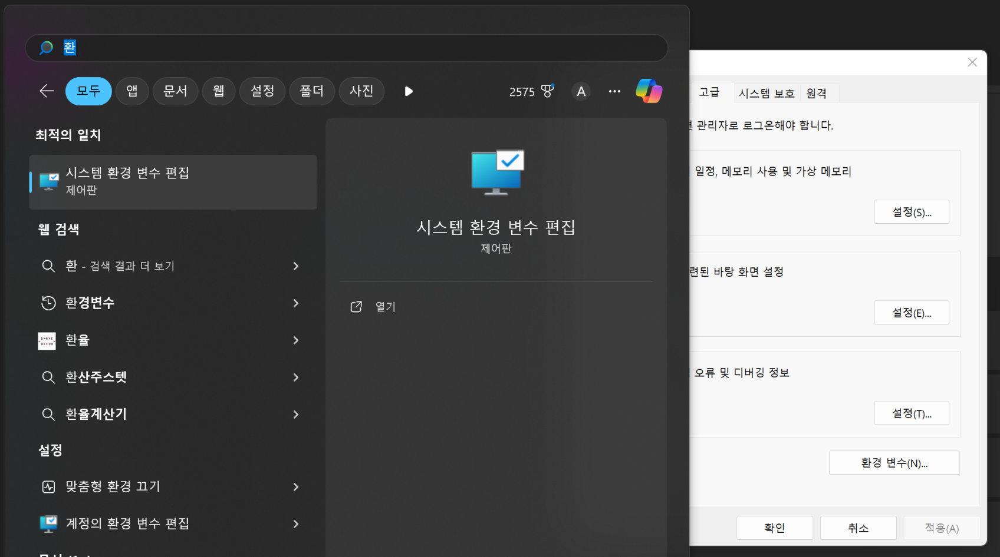
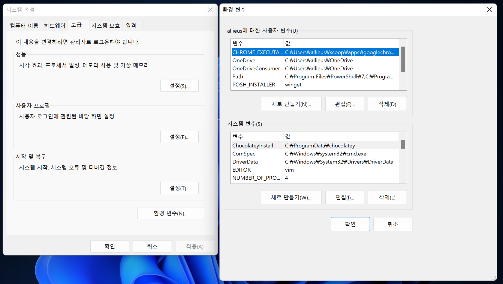
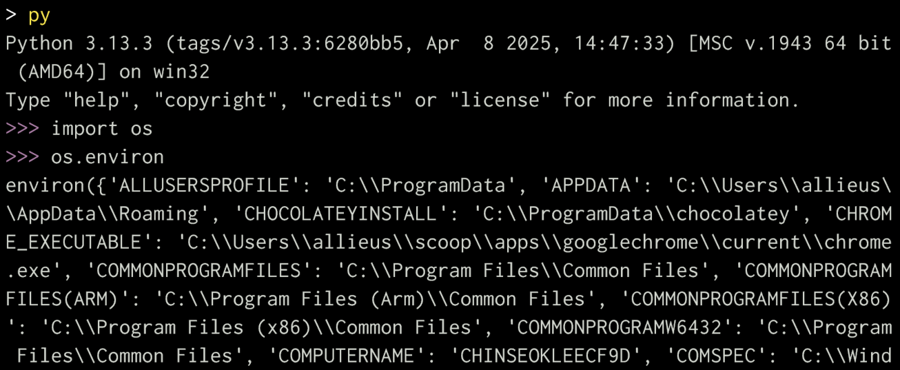
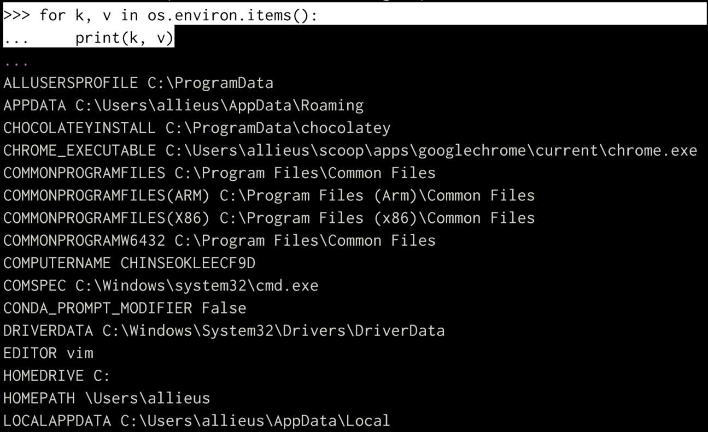
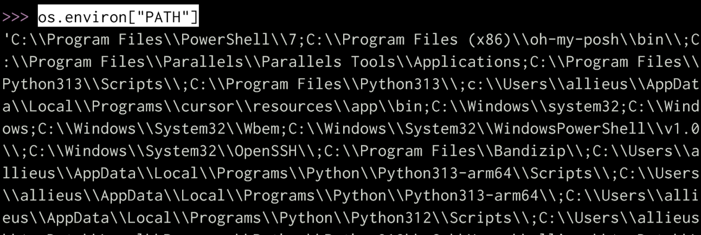
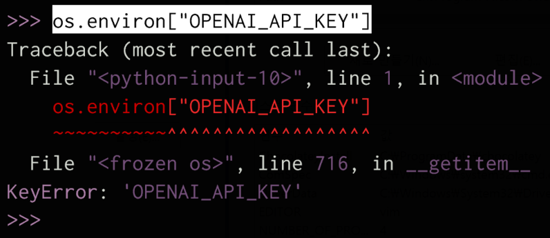
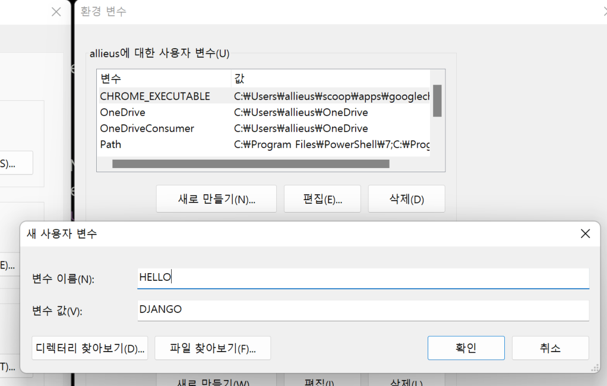
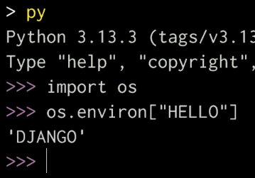

# 윈도우에서 환경변수

## 환경변수 설정 UI

## 파이썬에서 현재 로딩된 환경변수 목록 출력하기

파이썬에서 각 환경변수 값을 순회돌면서, k, v 출력

현재 없는 환경변수에 접근하면 KeyError 발생

애플리케이션 내에서 사용할 어떠한 설정을 외부에서 주입하는 방법으로

주입 (Injection)

다양한 방법이 있을 수 있지만
환경변수 방법을 일반적으로 프로그래밍 언어/프레임워크 불문하고
많이 사용합니다.
단, 환경변수를 지정하는 방법은 방법이 다양하고
구동환경에 맞춰 지정해주셔야 합니다.
이는 환경변수 지정방법이 OS/인프라 의존적이라서 그렇습니다.

## 새 환경변수 등록

확인, 확인, 확인  하신 후에
터미널을 다시 열어주셔야 해요.

그래야, 터미널이 새로 열리면서
환경변수를 다시 로딩합니다.

다시 터미널을 새롭게 켜주시고
파이썬 내에서 현재 로딩된 환경변수 중에
"HELLO" 환경변수를 출력해보세요.

환경변수 값을 올바르게 지정하고
로딩된 환경변수 값을 확인하는 방법을 알고, 그리고 습관이 필요하다.
컴퓨터에 전역으로 사용하는 환경변수는
방금처럼 사용자 환경변수에 넣어두시는 것도 좋아요.
프로젝트마다 사용하는 환경변수가 다를 경우,
프로젝트에서 사용하시는 환경변수가 엄청 많을 경우,
일일이 이렇게 환경변수를 지정하는 것은 번거롭고
관리성도 나빠요.
