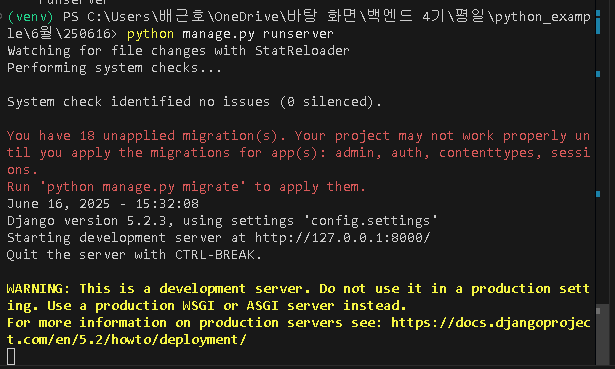
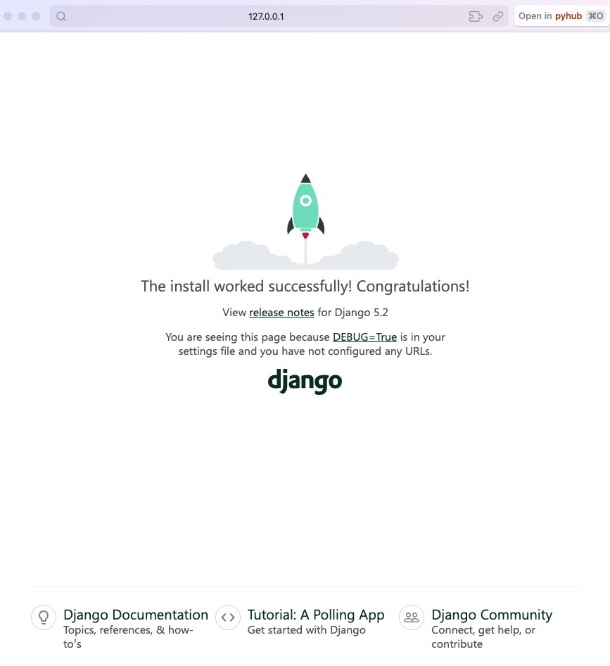
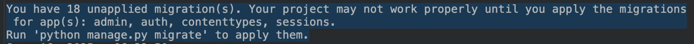
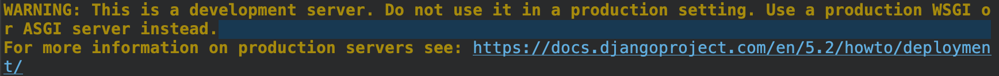
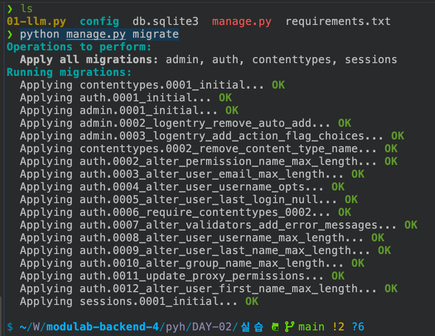
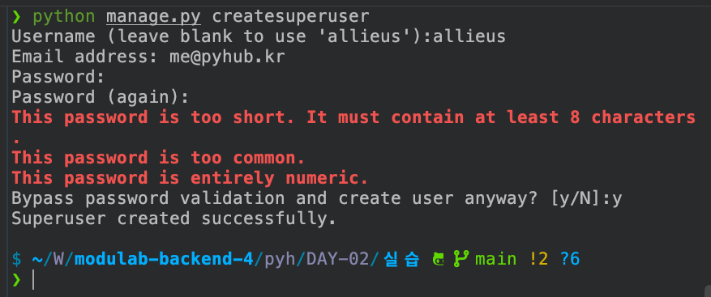
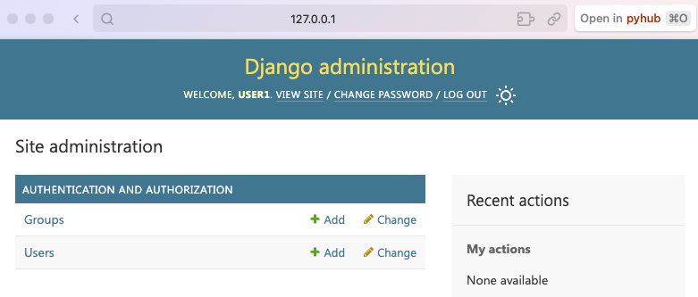
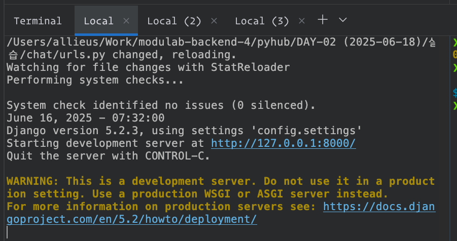
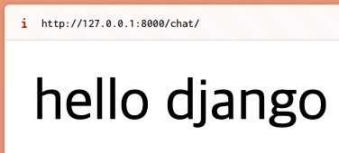
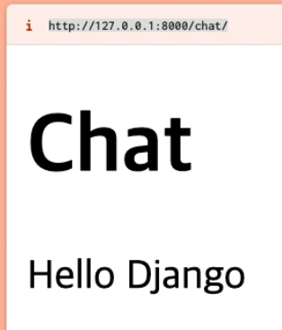

# 장고 프로젝트 생성 및 초기 작업

## 장고 라이브러리 설치

이에 앞서 프로젝트마다 가상환경 생성 및 활성화해주시고, VSCode 등에서 해당 가상환경 지정도 해주세요.

```
# 5.2.x 버전 중에 최신 버전 설치
python -m pip install --upgrade 'django~=5.2.0'
```

## 장고 프로젝트 생성

프로젝트 생성을 원하는 디렉토리로 이동하신 후에, 빈 디렉토리를 먼저 생성하고 이동해주시고

```
cd 프로젝트_생성을_원하는_디렉토리
mkdir new_project
cd new_project
```

디렉토리 안에서 다음 명령으로 새로운 장고 프로젝트를 생성합니다.

```
python -m django startproject config .
```

끝에 마침표(`.`)는 현재 디렉토리에 프로젝트를 생성한다는 의미입니다.

## 장고 개발 서버 구동

장고에서는 장고 기본에서 개발서버를 지원합니다.

```
python manage.py runserver
```

> `manage.py` 파일을 `python` 명령을 실행하는 명령입니다. 그러니 `manage.py` 파일이 있는 경로에서 항상 `python` 명령을 실행해주셔야 합니다.

아래와 같이 로그가 뜨시면 성공입니다.

이 페이지는 우리가 현재 장고 프로젝트에서 아무런 기능도 구현하지 않았을 때에만 뜹니다.
하나의 기능이라도 넣으면 자동으로 없어져요.



웹브라우저로 http://127.0.0.1:8000 주소로 접속하시면 아래의 웰컴 페이지가 뜨실 겁니다.



> 주의: https://127.0.0.1:8000 처럼 `https://` 프로토콜로 접속하시면 안 됩니다. `http://` 입니다. `https` 프로토콜은 보안화된 프로토콜로, 현재의 개발서버는 `http` 만을 지원하기 때문에 `https`로 접속하시면 서버에서 요청을 처리할 수 없습니다.

개발서버 로그에서 아래 경고는 장고의 마이그레이션 기능 (데이터베이스 테이블 자동 생성) 이 있는 데, 아직 생성되지 않은 테이블이 18개가 있다는 경고입니다. 곧 `python manage.py migrate` 명령으로 관련 데이터베이스 테이블을 생성하면 더 이상 뜨지 않습니다.



아래 경고는 `python manage.py runserver` 는 개발서버이니 실서비스 목적으로는 사용하지 말라는 경고입니다. 실서비스에서는 `gunicorn`, `uvicorn` 등을 사용하게 됩니다.



## 관련 데이터베이스 테이블 생성

현재 서버의 디폴트 데이터베이스는 현재 경로에 `sqlite3` 데이터베이스입니다. `config/settings.py` 에서 `DATABASES` 설정에 기본 설정되어있습니다.

`python manage.py migrate` 명령을 수행하시면, `db.sqlite3` 파일이 생성되며
관련 데이터베이스가 생성됩니다.



> 참고: `DATABASES` 설정에 `PostgreSQL` 데이터베이스를 바라보도록 설정하시면, `python manage.py migrate` 명령으로 PostgreSQL 데이터베이스에 데이터베이스 테이블이 생성됩니다.

## 현재 데이터베이스에 슈퍼 유저 계정 생성

`python manage.py createsuperuser` 명령으로 슈퍼유저를 생성해주세요.



> 현재 바라보고 있는 데이터베이스에 슈퍼유저 계정이 생성됩니다.

## admin 페이지 접속

웹브라우저로 http://127.0.0.1:8000/admin/ 페이지에 접속하신 후에,
방금 생성하신 슈퍼유저 계정으로 로그인을 해주세요.



> 참고: 장고 기본에서 유저는 일반 유저, staff 유저, superuser 로 나뉘며, staff 유저와 superuser 만이 `admin` 페이지에 접속한 권한이 있습니다.

## 새로운 django 앱 만들기

`python manage.py startapp chat` 명령으로 새로운 장고앱 `chat`을 생성합니다.
그러면 현재 디렉토리에 `chat` 폴더가 자동 생성됩니다.

### `chat` 앱 등록

장고 프로젝트에서 사용할 모든 장고 앱은 반드시 `settings.INSTALLED_APPS` 리스트에 등록해야만 합니다. 그래야만 장고 앱으로서 대접받을 수 있습니다.

```python
# config/settings.py

INSTALLED_APPS = [
    # ...
    "chat",
]

```

### `chat` 앱 기본 파일 생성

`chat` 앱내에서 요청을 처리하는 View 함수에 대한 라우팅은
`chat/urls.py`을 통해 정의합니다.

```python
# chat/urls.py 파일 생성
from django.urls import path
from . import views

urlpatterns = [
    # 아래에서 곧 구현합니다.
    # 이 코드를 저장하시면 개발서버에서 index 함수를 찾지못해 오류가 발생할 것이지만,
    # 아래 chat/views.py 저장 후에는 해당 오류가 사라질 것입니다.
    path("", views.index),
]
```

프로젝트의 URL 라우팅 파일인 `config/urls.py`에서 `chat/urls.py` 파일을 포함시킵니다.

```python
# config/urls.py 수정

from django.contrib import admin
from django.urls import path
from django.urls import include  # ADDED

urlpatterns = [
    path("admin/", admin.site.urls),
    path("chat/", include("chat.urls")),  # ADDED
]
```

`chat/views.py` 경로에 첫 장고 View를 구현합니다.
이 `index`뷰가 호출되면 텍스트로서 `hello django` 응답을 합니다.

```python
# chat/views.py

from django.http import HttpResponse
from django.shortcuts import render


# django view : http 요청을 받아 요청을 처리하는 함수
#  - 항상 1개 인자가 있고, request를 통해 모든 요청 내역을 조회 가능
def index(request):
    return HttpResponse("hello django")
```

## 웹페이지 접속 확인

`python manage.py runserver` 명령이 구동 중인 터미널을 확인해주시고,
아래와 같이 오류없이 잘 구동 중인 상황이여야 합니다.



http://127.0.0.1:8000/chat/ 페이지로 접속하시면 아래의 페이지를 확인하실 수 있습니다.



> 참고: http://127.0.0.1:8000/ 로 접속하시면 Page not found 응답이 오는 것이 맞습니다. 아직 최상위 주소 요청에 대해 처리해주는 View 함수가 없기 때문입니다.

### 템플릿 응답을 해봅시다.

`chat/templates/chat/index.html` 경로에 아래의 HTML 템플릿을 생성합니다.

```
{# chat/templates/chat/index.html #}

<!doctype html>
<html lang="ko">
<head>
    <meta charset="UTF-8">
    <meta name="viewport"
          content="width=device-width, user-scalable=no, initial-scale=1.0, maximum-scale=1.0, minimum-scale=1.0">
    <meta http-equiv="X-UA-Compatible" content="ie=edge">
    <title>chat</title>
</head>
<body>
    <h1>Chat</h1>

    Hello Django

</body>
</html>
```

그리고 `chat/views.py` 파일에서 `index` 함수에서 `render` 함수를 통해
`chat/index.html` 템플릿을 통한 응답을 하도록 수정합니다.

```python
# chat/views.py
from django.http import HttpResponse
from django.shortcuts import render

# chat/templates/chat/index.html 에서
# chat 경로명은 2번 씁니다 !!! 1번 쓰면 안되나요? 안 되요 !!
# 그 이유는, 나중에 !!!

# django view : http 요청을 받아 요청을 처리하는 함수
#  - 항상 1개 인자가 있고, request를 통해 모든 요청 내역을 조회 가능
def index(request) -> HttpResponse:
    # django template < jinja2

    # text, image, pdf, excel, video streaming 등등 다양한 응답이 가능
    # return HttpResponse("hello django")
    return render(request, "chat/index.html")  # ADDED
```

다시 http://127.0.0.1:8000/chat/ 주소로 접속하시면
아래와 같이 HTML 템플릿을 통한 응답 생성이 이뤄지고
그 응답을 받았음을 확인하실 수 있습니다.


